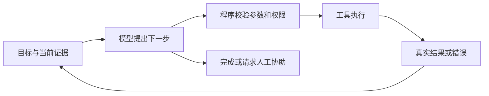

# 01｜ReAct、Plan-and-Execute、多 Agent：谁决定下一步？

> 阅读起点：了解 Python 函数和 HTTP 请求即可。本文依据截图中的主题重新编写，并非对未提供原文的摘要。资料核验日期：2026-09-15。

## 先看一个真实问题

我们要给 FastAPI 服务加一个工单助手。用户说：“这张工单反馈退款迟迟不到账，帮我查清原因，拟一份回复。”助手能读取工单、查询已批准的知识库、生成草稿；发送回复、修改工单必须取得人的授权。

普通的一次模型调用能生成文字，但它未必知道工单内容、退款进度，也不知道刚刚查询是否失败。要解决任务，就需要把模型接到外部信息和执行结果上。

**本章的本质：Agent 把“下一步做什么”交给模型在约束内判断，程序负责真正执行、记录结果和守住边界。** 模型不因为写出“已经退款”就真的完成退款。

## 1. 先分清模型、工作流和 Agent

| 概念 | 下一步由谁决定 | 工单例子 |
|---|---|---|
| 单次模型调用 | 调用它的程序 | 给定工单和政策，生成回复草稿 |
| 固定工作流 | 程序预先规定的路径 | 读取工单 → 检索政策 → 生成草稿 → 校验 |
| Agent | 模型依据当前信息选择下一步，程序限制可执行范围 | 发现订单号缺失，先补查；发现状态冲突，再查权威来源 |

这是 Anthropic 对 workflow 和 agent 的一种实用架构区分，不是全行业唯一词典。该文章强调：步骤明确时，固定工作流通常更容易预测；只有任务需要动态决策时，才值得增加自主循环。[来源 2](https://www.anthropic.com/engineering/building-effective-agents)

判断项目是不是 Agent，不能只数模型调用次数。程序固定调用五次模型，仍可能只是工作流；一个模型能根据工具返回决定再查什么，就可以形成 Agent 循环。

## 2. ReAct：让行动结果改变下一步

这里的 ReAct 是 Reasoning + Acting，与 React 前端框架无关。原始论文把推理轨迹和任务行动交替安排：推理用于形成、跟踪和修改计划，行动用于从知识库或环境获得新信息。[来源 1](https://arxiv.org/abs/2210.03629)

可以把它理解为排查接口故障：先判断缺什么证据，再查日志，看到结果后调整方向。类比的边界是，模型的语言解释不等于人类意识，也不是可靠性的证明。



一次工单处理轨迹可以这样记录。下面是可观察行为示意，不是要求模型公开内部思维链：

```text
目标：为 T-104 工单准备有依据的回复草稿。
动作：read_ticket(ticket_id="T-104")
观察：工单只有退款申请日期，没有银行到账状态。
动作：search_approved_kb(query="退款处理时限", product="A")
观察：找到当前政策及版本；政策只能说明一般时限。
结果：草稿说明一般时限，并标明到账状态尚未核实；不承诺已到账。
```

原始 ReAct 论文研究了显式 reasoning trace；现在产品中的内部推理、API 工具调用记录和展示给用户的说明可能是不同东西。工程上应验证工具参数、实际结果、引用和最终产物，而不是把一段看似合理的“思考过程”当作执行证明。

还有一个容易漏掉的点：**观察也有可信度。** HTTP 200 表示服务器将请求报告为成功，但仍需核对返回内容与业务验收条件；工单正文属于用户内容，不能因为被工具返回就升级成系统指令。权限与提示词注入见[第 03 章](03-tool-call-hitl-security.md)。

## 3. Plan-and-Execute：先给长任务一个骨架

Plan-and-Execute 是“先拆出计划，再逐项执行”的设计模式；不同框架可能采用不同实现，本章不把它当作某个唯一标准 API。

对一张简单工单，先规划可能只是多一次调用。对“整理 30 张相似工单、找出共同原因、给出建议”，计划就能帮助维护全局进度：

1. 明确样本范围、可访问数据和输出要求。
2. 按问题类型分组，查找已批准的政策与历史处理依据。
3. 对每组总结共同点、差异和证据不足之处。
4. 生成报告并核对引用；涉及外部写操作时进入授权步骤。

**计划是待验证的假设。** 假如第 2 步发现产品版本不同，就应该重新分组，而不是继续执行已失效的计划。把计划保存为带状态的任务列表，比只留一段“我要先做 A 再做 B”的文字更有用。

注意“重新规划”不等于“撤销过去”。如果已经发送了消息，改写计划不会收回消息；有副作用的操作需要单独的业务补偿机制。这里就是规划能力和事务能力的边界。

## 4. 多 Agent：拆开工作，也拆开上下文

多 Agent 通常指多个具有各自任务、上下文或工具范围的执行单元协作；它们可以使用同一个模型，不必每个角色都换一个模型。

对复杂工单，可以让一个单元检索政策，一个单元分析只读日志，主单元整合证据。收益来自任务独立和上下文隔离，而不是给模型取了“专家”名字。

Anthropic 区分了预先切好的并行任务和 orchestrator-workers：后者由协调者根据输入动态决定子任务，再综合结果。[来源 2](https://www.anthropic.com/engineering/building-effective-agents) 将大量探索细节留在子任务，只回传带来源的摘要，也是上下文管理的一种办法；但摘要可能丢失细节。[来源 3](https://www.anthropic.com/engineering/effective-context-engineering-for-ai-agents)

| 适合拆开的情况 | 不适合拆开的情况 | 原因 |
|---|---|---|
| 政策检索和日志分析相互独立 | 后一步必须等待前一步的唯一结果 | 串行依赖不会被角色数量消除 |
| 多个资料源可以各自核查 | 几个 Agent 都改同一张工单 | 共享写入会产生冲突和重复操作 |
| 子任务输出可以清楚验收 | 只说“你们讨论到一致为止” | 没有客观标准，讨论也可能放大同一种错误 |

工程上让子任务返回“结论、证据位置、未解决问题”比返回整段聊天更容易整合。多个 Agent 重复同一错误并不少见，因此多数票不是事实核验的替代品。

## 5. 三个词不是三选一

它们回答不同问题：ReAct 关心如何在行动后更新判断；Plan-and-Execute 关心怎样组织长任务；多 Agent 关心任务由几个执行单元承担。一个主 Agent 可以先规划，再分配子任务；每个子任务内部又运行工具反馈循环。

但在我们的第一版工单助手里，合理起点是固定的“读取 → 检索 → 草稿 → 校验”。只有真实样本出现需要动态补查的情况，才加入有限的 Agent 循环。每次增加复杂度，都要能说明改善了哪一类失败。

## 6. 工作中怎样判断方案有没有变好？

先约定验收标准，而不是只观察“回答像不像专家”。例如：事实能追溯到来源；缺少订单状态时不承诺退款完成；越权资料不进入上下文；授权前不会发送消息。

记录每个任务的成功与失败原因、工具错误、调用次数、耗时和费用。循环还必须有最大步数、总时限，以及重复调用但没有新证据时的退出路径。次数取多少取决于业务，这里不制造一个通用的“最佳值”。

同一批代表性工单分别运行固定工作流和动态方案。如果只是多写了几段解释，却没有提高正确率或减少人工工作量，就没有证据说明增加 Agent 值得。官方文章也将评估结果作为增加复杂度的前提。[来源 2](https://www.anthropic.com/engineering/building-effective-agents)

## 7. 面试表达与小练习

**面试问：ReAct 和多 Agent 有什么区别？**

可以答：“ReAct 是单个执行过程中的反馈模式，让模型根据行动结果调整下一步；多 Agent 是任务分工方式。多 Agent 的每个单元都可以采用 ReAct。是否拆分取决于任务独立性、上下文负担和协调成本，而不是 Agent 越多越强。”接着用工单政策检索和日志分析的例子说明边界。

**练习：** 助手连续五次用同样参数查询退款状态，返回相同结果。团队准备再加一个“监督 Agent”。你首先做什么？

**参考答案：** 先检查现有循环能否识别重复动作和无信息增益，工具是否返回了明确的业务状态，以及是否缺少下一步可用工具。若数据源本身没有状态，更多 Agent 也查不出来；应停止并说明缺失证据，必要时交给有权限的人。只有监督确实改善已定义的失败类型，才值得增加额外调用。

## 来源与时效

以下资料均在 **2026-09-15 实际读取**。原始论文支持研究定义；官方工程文章支持设计模式，不代表任意模型、业务上都有相同收益。

1. [ReAct: Synergizing Reasoning and Acting in Language Models](https://arxiv.org/abs/2210.03629)，2022 年首稿，2023 年 ICLR 版本；本次核实摘要与版本信息，未据此扩展未读的实验细节。
2. [Anthropic：Building effective agents](https://www.anthropic.com/engineering/building-effective-agents)，2024-12-19 发布；当前页已提醒工具生态发生变化，本章仅使用其架构区分与工程原则。
3. [Anthropic：Effective context engineering for AI agents](https://www.anthropic.com/engineering/effective-context-engineering-for-ai-agents)，2025-09-29；本章使用其按需检索和子任务上下文管理思想，不将文章当时的产品状态视为当前状态。

下一篇：[记忆、RAG 与长上下文](02-memory-rag-long-context.md) · 返回[阅读导航](README.md)
