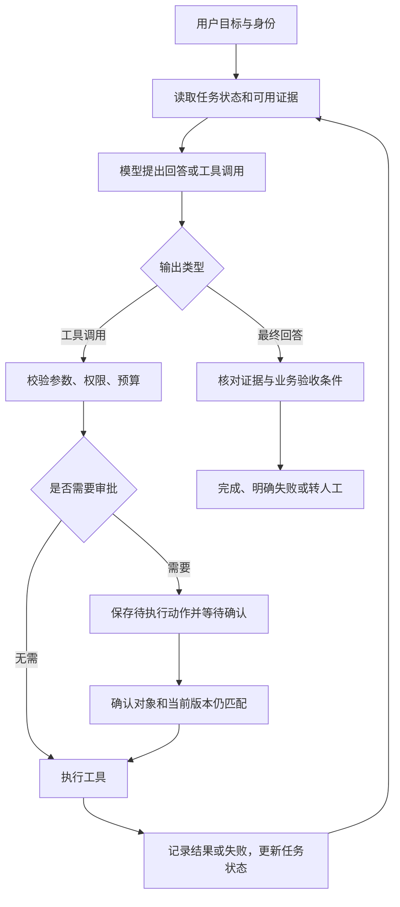

# 09｜Harness：谁让模型持续、可控地把事情做完

> 阅读基础：Python、HTTP/API。资料查阅日期：2026-09-15。本文的 Harness 是工程术语，没有一份规定所有实现的统一标准。

## 1. 从一个失败场景开始

你让工单助手“查清 42 号工单的问题，起草回复，确认后再更新状态”。模型给出了一份漂亮的计划，但程序重启后忘了执行到哪里；重试时又把同一条回复发了两遍。

这两个问题不是再补一句“请认真执行”就能可靠解决的。需要程序记住任务状态、决定哪些动作可以执行、处理失败，并检查最后的业务结果。

**Harness 的本质：围绕模型建立执行与反馈的规则，让一次次模型输出变成可以追踪、限制、恢复和验证的任务过程。**

模型像提出下一步行动的工作人员；Harness 像工作台、流程制度和记录系统。类比的边界是：Harness 也可能使用模型来规划或评分，但权限和数据一致性不能只靠模型自觉。

OpenAI Agents SDK 的运行文档明确描述了“调用模型 → 检查输出 → 执行工具或移交 → 继续循环 → 返回最终结果”的过程。[S1] Anthropic 的长任务案例则展示了进度文件、增量工作和结果验证如何帮助跨上下文窗口继续任务。[S2]

## 2. 把容易混淆的层次拆开

| 层次 | 负责什么 | 工单助手里的例子 |
|---|---|---|
| 模型 | 根据输入预测输出，提出回答或动作 | 建议先查工单，再查退款规则 |
| Agent 策略 | 决定如何选择下一步 | 信息不足就检索，有证据才起草 |
| 工具 | 提供具体能力 | `get_ticket`、知识检索、提交回复 |
| Runtime | 实际执行代码，管理进程、超时等 | 执行 HTTP 请求，等待工具返回 |
| Harness | 组织上述部分的任务生命周期 | 预算、状态、审批、恢复、验收 |
| Evaluation harness | 在固定条件下运行和评分 | 用一批测试工单比较两个版本 |

现实框架可能把这些能力放在一个包里；表格是责任划分，不要求你创建六个类。遇到别人说“换了 Harness，模型更强了”，应追问改了哪些工具、上下文、预算和验证条件，不能直接推导出模型本身提升了。

## 3. 一次完整任务如何运转



以上是教学设计，不是某个 SDK 的固定接口。还需要把“工具失败、拒绝、预算耗尽”等分支导向明确状态，不能在异常时无条件继续循环。

对 42 号工单，具体过程是：

1. 服务端从认证信息取得用户身份和租户，不能信任模型传来的 `tenant_id`。
2. 读取工单与用户可访问的知识库，记录文档版本和证据位置。
3. 模型生成回复草稿。此时只是产物，工单没有被修改。
4. 展示待提交的正文、目标工单、状态变更，让有权限的人确认。
5. 提交前再次验证权限、工单版本和审批是否仍对应这个动作，使用幂等键防止重复提交。
6. 查询或核对持久化结果，确认目标工单只新增一条正确回复，再报告完成。

审批是任务暂停点。OpenAI 的运行文档特别提醒：审批后应从原状态恢复，不能把它误当成一个全新的用户回合。[S1] 具体如何保存状态，由使用的框架与存储实现决定。

## 4. 一个不用模型 API 的 Python 小实验

下面的独立代码块可直接运行，只使用标准 Python。假模型固定请求一次只读工具，再根据返回值回答，目的是看清“谁在执行”和“观察结果如何进入下一轮”。它不是可上线的 Agent。

```python
def fake_model(observations):
    if not observations:
        return {"type": "tool", "name": "get_demo_ticket", "id": 42}
    return {"type": "final", "text": observations[-1]["status"]}


def get_demo_ticket(ticket_id):
    if ticket_id != 42:
        raise ValueError("This demo contains ticket 42 only")
    return {"id": 42, "status": "open"}


def run(model, max_steps=4):
    observations = []
    for _ in range(max_steps):
        action = model(observations)
        if action["type"] == "final":
            return action["text"]
        if action["type"] != "tool" or action["name"] != "get_demo_ticket":
            raise ValueError("Unsupported action")
        observations.append(get_demo_ticket(action["id"]))
    raise RuntimeError("Step budget exhausted")


assert run(fake_model) == "open"
try:
    run(lambda _: {"type": "tool", "name": "get_demo_ticket", "id": 42}, 2)
except RuntimeError:
    pass
else:
    raise AssertionError("A looping model must hit the step limit")

try:
    run(lambda _: {"type": "tool", "name": "delete_ticket", "id": 42})
except ValueError:
    pass
else:
    raise AssertionError("Unknown actions must be rejected")

print("Harness demo checks passed")
```

注意三处机制：模型输出 `tool` 并不会自己运行函数；`run` 决定执行哪个工具；返回值加入 `observations` 后，模型下一轮才有新信息。

这个例子没有持久化、真实认证、并发控制和写操作，适用于理解循环。实际接入用户输入与外部服务时，需要按[第 03 章](03-tool-call-hitl-security.md)补齐信任边界。步数上限只是防止循环的一道限制，不能代替每次调用的超时、费用限制或完成判定。

## 5. 为什么有了“记忆”还会做不完

聊天记录回答“刚才说过什么”，任务状态还必须回答“已经发生了什么，接下来允许发生什么”。

| 应保存的信息 | 为什么重要 |
|---|---|
| 目标与验收条件 | 防止做了一部分就宣布完成 |
| 证据与版本 | 防止摘要遗失来源，或使用已过期规则 |
| 已完成步骤与结果 ID | 区分真实执行结果和模型计划 |
| 待审批动作及版本 | 防止确认之后偷偷换了目标或正文 |
| 幂等键与提交结果 | 恢复时判断是否已经产生副作用 |
| 尚未解决的问题 | 防止新一轮重复走无效路径 |

Anthropic 2025-11-26 的案例采用初始化阶段建立任务清单，后续阶段每次完成小部分并留下进度与测试证据。[S2] 这是一个经过实验的工程案例，不是“所有任务都必须设两个 Agent”的定理；短小任务通常不需要额外调度系统。

同理，压缩上下文能节省空间，但压缩是有损的。正确的工单状态应以业务数据库为准，不能用模型摘要替代它。重新读取关键状态通常比相信一段旧总结更可靠。

## 6. 怎样证明你的 Harness 改善了结果

先定义业务成功，再比较。对于“确认后提交工单回复”，成功至少包括：回复有依据、目标正确、权限有效、确认匹配、只提交一次。只检查最后文字是否流畅会漏掉真正的失败。

| 指标 | 怎么测 | 容易误判的地方 |
|---|---|---|
| 任务成功率 | 验收全部满足的任务数 / 总任务数 | 只看模型自报成功 |
| 工具选择与参数正确性 | 比较动作和允许目标 | JSON 合法但对象错了 |
| 安全约束违反次数 | 检查越权读取、未授权写入等 | 用高平均分掩盖严重失败 |
| 成本 | 统计成功与失败尝试的全部费用 | 漏掉重试、工具和人工复核 |
| 延迟 | 记录端到端 p50、p95 与各阶段耗时 | 平均值掩盖少量极慢请求 |

OpenAI 的评估指南强调任务特定数据、边界与对抗案例、持续评估，以及用人类标注校准模型评分。[S3] 对话质量可以由模型辅助评分；写错工单、重复提交、越权访问等可明确判定的事实，优先使用程序和业务记录检查。

初学时可以收集几十个有代表性的工单案例建立基线；这个数量只是启动建议，不提供统计置信度保证。保留未用于调提示词的评估集，固定工具版本、输入和预算，多次运行有随机性的案例；报告样本数和失败分布。更换模型同时换工具、预算、提示词，就无法知道提升来自哪里。

## 7. 什么情况下值得引入框架

只有读工具、单次完成的小助手，几段普通应用代码可能就够。需要跨进程恢复、长时间等待审批、多步骤状态流转时，成熟的执行框架能减少状态管理工作；它仍然不会替你定义权限或业务正确性。

截至查阅日，OpenAI 官方将“在应用中运行的 Agents SDK”与“在服务端运行托管 Harness 的 Agents API”区分开来。[S4] 这说明 Harness 可以自行部署，也可以作为托管服务的一部分。选择时应比较运行环境、数据边界、状态恢复能力和成本，而不是只看是否叫 Agent。

另一个易过时点：当前评估指南包含 Evals 平台的退役通知。[S3] 评估方法依然适用，但采用某个托管评估产品前应重新核对服务状态。本文没有依赖该平台的执行代码。

## 8. 自测

**问题：** 工具已成功提交回复，程序却在写入本地“已完成”记录前崩溃。恢复时重跑工具，可以吗？

**解析：** 不能仅凭本地没有成功记录就断定远端没执行。优先用原幂等键或远端结果查询确认；状态不明时进入待核对状态，避免重复产生副作用。仅仅增加 checkpoint 不会让两个独立系统自动拥有一个原子事务。延伸见[工作案例 4](11-workplace-troubleshooting.md)。

## 资料与适用范围

以下来源均于 2026-09-15 实际查阅。链接中的 API 名称与托管产品能力会变；本文的流程图、工单例子与最小代码是教学设计。

- [S1｜OpenAI：Running agents](https://developers.openai.com/api/docs/guides/agents/running-agents)——运行循环、状态延续、流式事件与审批暂停。
- [S2｜Anthropic：Effective harnesses for long-running agents](https://www.anthropic.com/engineering/effective-harnesses-for-long-running-agents)——2025-11-26 发布的长任务工程案例，不代表所有领域的统一最优方案。
- [S3｜OpenAI：Evaluation best practices](https://developers.openai.com/api/docs/guides/evaluation-best-practices)——评估设计、工具选择、参数、移交与模型评分局限；页面同时包含产品退役通知。
- [S4｜OpenAI：Agents SDK](https://developers.openai.com/api/docs/guides/agents/sdk)——SDK 的责任边界及与托管运行方式的区分。

[返回导航](README.md) · [上一章：产品与框架](08-claudecode-codex-langchain.md) · [下一篇：面试题解析](10-interview-questions-and-answers.md)
