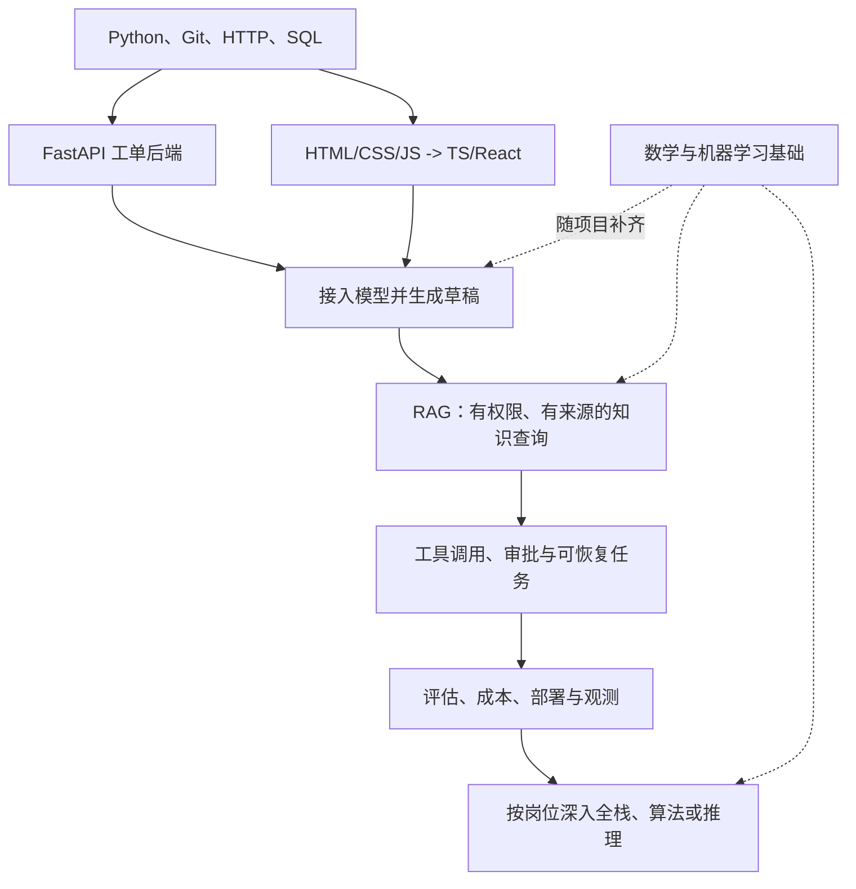

# 12｜AI / Agent 工程学习路线：学什么、学多深、用什么证明学会了

> 适用起点：已有一些 Python、HTTP/API 基础，希望提升工作能力、准备面试，并能独立做出可用的 AI / Agent 应用。
>
> 编写与资料核对日期：2026-09-15。主线建议是 **Python + FastAPI + PostgreSQL + TypeScript / React + 模型 API + 可评估的 Agent 流程**。这是结合你当前项目和学习目标的建议，不是所有 AI 岗位的统一招聘标准。

## 1. 先确定：你要进入 AI 的哪一类工作

“做 AI”覆盖的工作差异很大。调用模型做产品、训练模型、优化 GPU 推理，虽然都与 AI 有关，但学习重点不同。

| 方向 | 主要交付什么 | 核心能力 | 在本路线中的位置 |
|---|---|---|---|
| AI 应用 / Agent 工程 | 能查询资料、调用工具、完成业务流程的应用 | 软件工程、模型集成、数据权限、RAG、工具执行、评估与部署 | **主线，最贴近你的目标** |
| AI 全栈 / 产品工程 | 完整的用户体验和可运营产品 | 主线能力，加前端交互、状态管理、流式体验、产品设计 | 主线的前端部分需要更深入 |
| 模型算法 / 后训练 | 数据、训练方法、模型效果及实验结论 | 数学、机器学习、PyTorch、训练和严格实验 | 后续分支，不能只靠 API 开发替代 |
| 推理 / AI 基础设施 | 模型服务的性能、稳定性与资源效率 | Linux、GPU、推理引擎、并行、容量与可观测性 | 后续分支，按岗位需要深入 |

**我对你的建议：先把 AI 应用工程这条链做完整，并具备交付基础前端的能力，再选一个方向深入。** 你不必先达到算法研究员的数学深度，才能开始做 Agent；但也不能只会调模型接口，就忽略数据库、权限、测试和故障恢复。

一个实际的 Agent 产品可以这样理解：

```text
用户界面 -> 身份与业务 API -> 模型及任务流程 -> 工具和数据
                  |               |
              权限与事务      证据、状态与预算
                  +------- 评估、观测、部署 -------+
```

为什么要学前后端？因为模型输出只是整个产品的一部分。用户需要看到正在做什么、补充缺失信息、审阅动作；服务端需要保护密钥和数据、执行工具、保存状态，并在失败后恢复。这些都是工作中的真实问题。

## 2. “了解、会用、掌握”分别到什么程度

以下等级是本路线自定义的学习标尺，不是认证标准。

| 等级 | 能力表现 | 怎样证明 |
|---|---|---|
| L1：能解释 | 说清解决什么问题、基本机制和适用边界 | 不看笔记，用自己的例子解释，并指出一个反例 |
| L2：能实现 | 查官方文档能完成小功能，并处理常见错误 | 从空文件或现有项目中完成任务，不只是照着视频抄 |
| L3：能交付和排错 | 能独立设计接口、测试、部署，定位失败并说明代价 | 拿出代码、自动检查、运行记录和一次排障证据 |
| L4：能深入优化 | 能分析内部机制、性能与复杂场景，形成可复现结论 | 提供剖析数据、对照实验和边界分析，而不是只调参数 |

对于 AI 应用岗位，建议形成下面的能力分布：

| 能力 | 建议目标 | 优先级 |
|---|---|---|
| Python、调试、Git、HTTP、SQL | L3 | 必修基础 |
| FastAPI、认证授权、数据一致性、测试 | L3 | 交付基础 |
| HTML/CSS/JavaScript/TypeScript/React | 后端侧 L2；全栈侧 L3 | 能交付界面，再按岗位加深 |
| 模型 API、上下文、RAG、工具执行 | L3 | AI 应用核心 |
| 评估、安全、成本、任务恢复 | L3 | 从演示走向可靠应用的关键 |
| Docker、Linux、CI、日志与基本监控 | L2 起步，逐步 L3 | 部署前必须补齐 |
| 概率统计、向量、机器学习、Transformer | L1—L2，关键概念必须讲清 | 与应用开发并行学习 |
| 一个 Agent 框架 | L2，必要的恢复与调试能力做到 L3 | 理解基本循环后，按编排或恢复需求选学 |
| PyTorch 基础小实验 | L2 | 用一次小型训练理解模型机制 |
| 微调、自部署推理 | 初期 L1；转对应岗位再升 L3—L4 | 有条件的进阶分支 |
| Go/Java/C++/Rust、Kubernetes、多 Agent 平台 | 按团队与任务选择 | 不同时列为入门必修 |

这里的 L3 不要求不用文档、不用 AI；它要求你能判断产物是否正确，并对它的失败负责。

## 3. 总路线与阶段验收



安全和测试要从第一条接口开始做，图中的后期阶段表示系统化完善，不表示可以最后才考虑。

| 阶段 | 学习重点 | 必须留下的产物 | 进入下一阶段的条件 |
|---|---|---|---|
| M0：补齐基础 | Python 项目、Git、HTTP、SQL | 命令行工单整理程序、可复现环境、基础 SQL | 能读懂错误，修改程序，并说明数据流 |
| M1：做可靠后端 | FastAPI、数据库、认证授权、迁移与测试 | 带权限的工单 CRUD 服务 | 跨用户访问被拒绝，错误输入有明确响应，再次升级到同一库版本不重复变更 |
| M2：做可用前端 | Web 基础、TS、React、请求与状态 | 工单列表、详情、草稿界面 | 手机宽度和键盘可用，加载/失败/空结果状态明确 |
| M3：接入模型 | 模型 API、结构化输出、流式、超时与用量 | 只读、只生成草稿的 AI 功能 | 不暴露密钥，取消和超时可处理，输出经过校验 |
| M4：增加知识检索 | 文档处理、搜索、引用、数据权限与评估 | 可追溯的知识库问答 | 能区分检索失败和生成失败，回答对应有效证据 |
| M5：增加行动 | 工具、审批、幂等、状态与恢复 | 经授权才提交的工单助手 | 幂等操作重试不重复；结果不明能核对，重启和拒绝路径可验证 |
| M6：可交付系统 | 回归评估、部署、观测、成本、备份 | 可部署演示、评估报告、运维说明 | 能从新环境启动，定位一次故障，恢复备份并复核结果 |
| M7：选择专长 | 全栈体验、复杂编排、后训练或推理 | 针对目标岗位的第二个专项作品 | 有实际问题和对照数据支持深入方向 |

不要等所有基础课程看完再做 M1。基础学习和小项目交替进行；如果能通过某阶段验收，就补缺口而不是重复从第一课开始。

## 4. 编程语言：三门主线，其他语言按岗位选

### 4.1 Python：从会写语法到能维护项目

**为什么学：** 当前模型 SDK、数据处理和 AI 实验大量使用 Python，你的 FastAPI 项目也已采用它。优先深化现有基础，可以更快把注意力放到真正的业务与 Agent 问题上。

应达到 L3 的内容：

- 函数、列表/字典/集合、模块与包、异常、文件和 JSON；知道可变对象、默认参数、浅拷贝可能产生什么问题。
- 类与组合、迭代器和生成器、上下文管理器；能读懂装饰器，先不钻研元类和解释器实现。
- 类型标注、数据模型、输入边界校验；明白类型提示不自动验证网络请求里的真实数据。
- 虚拟环境、`pyproject.toml`、依赖与锁文件、配置和日志；知道运行的是哪个解释器、哪个工作目录。
- 调试器、断点、异常堆栈与小范围验证；能定位错误发生在哪层，而不是遇到异常就全部 `except` 掉。

**验收：** 独立写一个工单 JSON 整理程序，拆成可导入模块，校验输入、处理不存在的文件和错误 JSON；给核心逻辑留下可执行检查，在新环境中按依赖记录运行成功。

学习资源：

| 资源 | 推荐学习范围 | 语言与用法 |
|---|---|---|
| [Python 官方教程](https://docs.python.org/zh-cn/3/tutorial/) | 数据结构、函数、模块、文件/JSON、异常、类、标准库与虚拟环境 | 中文入口，部分内容可能仍为英文；适合已有编程基础的人查漏补缺 |
| [uv：Working on projects](https://docs.astral.sh/uv/guides/projects/) | 项目文件、依赖管理、运行与锁文件 | 英文；结合本项目实际操作，理解声明依赖与锁定版本的区别 |

### 4.2 Python 异步与并发：在接外部 API 时掌握

目标为 L2 起步、服务开发中达到 L3：理解 `async/await`、协程、任务、有界并发、超时、取消与资源清理；区分 I/O 等待和 CPU 计算。

例如同时读取几张独立工单可以减少等待；依赖前一步结果的提交不能随意并行。`async def` 里直接调用阻塞库仍会阻塞；异步也不会自动让 CPU 密集计算变快。FastAPI 对同步路由的调度，与在异步函数里直接调用普通辅助函数的行为不同。

**验收：** 并发调用几个只读服务，其中一个故意变慢或失败，系统仍能明确处理超时和取消，其他请求不被长期阻塞；能解释并发上限为何必要。

资源：[asyncio 官方文档](https://docs.python.org/zh-cn/3/library/asyncio.html)，先读任务、超时、同步与队列；[FastAPI 的并发与 async/await](https://fastapi.tiangolo.com/async/)，核对框架实际调度方式。

### 4.3 JavaScript / TypeScript：为完整产品补齐浏览器能力

先学 JavaScript，再学 TypeScript。至少理解对象与数组、函数、模块、事件、DOM、Promise、`async/await`、请求与 JSON；随后学习常用类型、联合类型、收窄、泛型基础和模块。

TypeScript 主要提供运行前的静态检查。后端返回了错误 JSON 时，写一个 `as Ticket` 不会让它变成合法工单；真实输入仍需要边界检查。

**验收：** 为工单和请求状态建立类型，能明确区分“加载中、成功、空结果、失败”，并正确处理接口返回；后端侧做到 L2，全栈方向做到 L3。

资源：[MDN 学习 Web 开发](https://developer.mozilla.org/zh-CN/docs/Learn_web_development)，先读 JavaScript 基础、异步和网络请求；[TypeScript Handbook](https://www.typescriptlang.org/docs/handbook/intro.html)，读 Everyday Types、Narrowing、Functions、Object Types、Generics 和 Modules。

### 4.4 SQL：不要让 ORM 替你理解数据库

SQL 也是主线语言，目标 L3：掌握查询、连接、聚合、排序、分页、主外键、唯一约束、事务、索引和参数化查询。

**验收：** 写出“按客户汇总未关闭工单”的查询；解释一条慢查询的执行计划；用事务保证工单变更和审计记录的一致性；能说明为何多一次索引也会增加写入成本。

资源：[PostgreSQL 事务教程](https://www.postgresql.org/docs/current/tutorial-transactions.html)、[Using EXPLAIN](https://www.postgresql.org/docs/current/using-explain.html)。结合实际表结构学习。`EXPLAIN ANALYZE` 会真正执行语句，练习使用隔离测试数据，特别注意写语句的副作用。

### 4.5 Go、Java、C++、Rust 什么时候学

如果目标团队后端使用 Go 或 Java，就在 Python 和 HTTP/SQL 基础稳固后补对应语言与生态；如果做 GPU 算子、底层推理或性能工程，C++/CUDA 等能力会更重要；Rust 可根据具体系统岗位需要选择。

做第一个 Agent 产品，不需要同时掌握它们。先做到“能沿一次请求把 Python、浏览器和数据库连起来”，再根据实际岗位描述找缺口。

## 5. 计算机与工程基础：不用先学完教材，但这些不能空白

| 主题 | 至少理解什么 | 掌握证据 |
|---|---|---|
| 数据结构与算法 | 列表、哈希表、栈/队列、树/图、复杂度、排序与基本搜索 | 能解释全表扫描与索引查找的代价，写清去重、分页和任务依赖处理 |
| 网络 | DNS、TCP/TLS、HTTP、请求头、代理、超时、连接池 | 能沿浏览器→代理→API→模型服务排查请求失败 |
| 操作系统 | 进程/线程、文件路径、权限、环境变量、端口与信号 | 能找到哪个进程占用端口，查看日志，正常停止服务并理解资源释放 |
| Git | 工作区/暂存/提交、分支、合并、冲突、diff、可审查的变更 | 独立完成一个功能分支并处理冲突，能解释改了什么和如何验证 |
| 软件设计 | 函数职责、模块边界、配置与逻辑分离、依赖和错误传播 | 能把认证、业务、工具与模型调用分清，又不为一个小功能堆抽象层 |
| 技术阅读与表达 | 看文档的适用版本、示例前提、错误提示与源码入口 | 能查一个未知参数，用中文准确解释英文原文中的 MUST/SHOULD 和限制 |

资源：[Pro Git](https://git-scm.com/book/en/v2)；[Ubuntu 命令行入门](https://ubuntu.com/tutorials/command-line-for-beginners)；网络与浏览器基础从 [MDN 学习区](https://developer.mozilla.org/zh-CN/docs/Learn_web_development)的 Web 机制部分开始。Git 是重点实践内容，Linux 从开发与部署真实遇到的问题逐步补齐。

算法练习要服务两件事：理解复杂度，以及通过目标岗位的编码考察。可以适度练数组、哈希、队列、树图与边界处理，但没有一个适用于所有 Agent 岗位的“刷满多少题”门槛。

## 6. 后端：让 AI 能安全地进入业务系统

### 6.1 FastAPI 与接口设计

目标 L3：路由、请求和响应模型、依赖注入、异常、分页、文件上传、配置、OpenAPI、数据库会话和连接管理。能够区分数据传输模型与内部数据库模型，避免把敏感字段直接返回。

HTTP 状态码和结构校验只是接口契约的一部分。还要说明业务状态、错误是否可重试、查询是否分页、写入是否需要版本条件。REST 是接口设计风格，不等于“返回 JSON”。

**验收：** 完成工单 CRUD 和草稿接口，覆盖正常请求、字段错误、对象不存在、权限不足；API 文档与真实行为一致。

资源：[FastAPI Tutorial](https://fastapi.tiangolo.com/tutorial/)，先完成核心教程，再按需要学习更高级的功能。沿用本项目已有数据访问方式即可，不为路线学习同时接入多套 ORM。

### 6.2 认证、授权、Session、JWT、OAuth / OIDC

必须能解释：认证回答“你是谁”，授权回答“你能对什么做什么”；Session 是会话管理机制，JWT 是令牌格式，可以组合使用，并非互斥方案；JWT 通常签名而非加密；OAuth 主要处理委托授权，OIDC 在其上提供身份层。

目标 L3 的重点是对象级授权、租户隔离、过期与撤销策略、密码安全存储、浏览器凭证与服务端密钥的边界。CORS 是浏览器跨源访问机制，不是身份认证；使用 Cookie 时要理解 CSRF，使用任何方案都要考虑 XSS。

**验收：** A 用户不能读取或修改 B 用户工单；伪造、过期凭证被拒绝；请求体中的 `is_admin` 不能赋权；模型密钥不出现在前端产物与浏览器请求中。

资源：[FastAPI JWT 教学](https://fastapi.tiangolo.com/tutorial/security/oauth2-jwt/)、[OWASP API Security Top 10](https://owasp.org/API-Security/editions/2023/en/0x11-t10/)、[RFC 9700](https://www.rfc-editor.org/rfc/rfc9700.html)。

**阅读边界：** FastAPI 教学适合学习签名、哈希和依赖校验，但其中的 OAuth 密码授权示例不应直接作为现代生产登录方案。RFC 9700 第 2.4 节明确禁止使用资源所有者密码凭据授权。接入身份提供商时，应学习 OIDC、授权码流程与 PKCE；这不是说所有第一方账号密码登录都等同于该授权类型。

### 6.3 数据建模、迁移、事务与并发

目标 L3：从业务关系设计表和约束，理解事务范围与隔离、并发更新、唯一约束、幂等、连接池，以及 ORM 生成的查询。会发现 N+1 查询，不能只会调用 `save()`。

迁移是有版本的结构变更，不是启动程序时无条件重建表。自动生成的迁移仍要审查现有数据、默认值、索引成本与旧应用兼容性。

**验收：** 从空库升级到当前结构；给已有工单增加字段且保留数据；工单变更与审计记录一起成功或回滚；并发修改不会静默覆盖。

资源：[Alembic Tutorial](https://alembic.sqlalchemy.org/en/latest/tutorial.html)，理解迁移流程；事务与查询性能使用第 4.4 节 PostgreSQL 资料。SQLModel、SQLAlchemy 等映射工具按项目选一条路径，迁移也按其实际兼容方式接入。

### 6.4 流式输出与后台任务

AI 应用要分清三件事：把生成中的内容传给用户、用户取消本次操作、任务是否需要在断开连接后继续。

目标 L2—L3：理解 HTTP 流式、SSE、WebSocket、断连、超时、背压与任务生命周期。SSE 常用于服务器推送事件；需要持续双向通信时再评估 WebSocket。选择取决于交互要求，不取决于哪个名字更新。

长任务不能简单绑在一个始终不结束的 HTTP 请求上。FastAPI `BackgroundTasks` 在响应后执行任务，不自动提供持久队列、跨进程恢复或可靠重试。需要这些能力时，先定义任务记录、幂等与恢复，再选择一套任务执行工具。

**验收：** 页面能显示生成进度、错误和最终状态；取消后停止可取消的工作；进程重启后的任务状态可查询，不能默默丢任务或重复写入。

资源：[FastAPI SSE 教程](https://fastapi.tiangolo.com/tutorial/server-sent-events/)、[Background Tasks](https://fastapi.tiangolo.com/tutorial/background-tasks/)。按安装版本核对现成能力，先理解协议与生命周期再决定依赖。

### 6.5 Redis、消息队列、对象存储：理解用途，按需求接入

第一版可以由 PostgreSQL 支撑业务数据与任务记录。有缓存、跨进程限流或队列需求时再评估 Redis；文件量与部署方式要求独立文件服务时再使用对象存储。

需要补的不是产品名字，而是缓存失效、TTL、缓存与权限的一致性，队列的重试/确认/死信，文件大小限制、内容校验、授权下载与保留策略。先达到 L1，真正采用时再做到 L3。

**验收：** 能说明为什么当前瓶颈需要该组件；加入后有前后对比，且不会因为缓存命中而跨租户返回数据。独立队列、分布式锁和多级缓存都不作为第一版的默认配置。

选学资源：[Redis Get Started](https://redis.io/docs/latest/develop/get-started/)，英文，从数据结构与客户端入口学习，再按实际问题补 TTL、失效和一致性；本次核对的是入门目录，未逐页阅读所有子教程。

## 7. 前端：做到用户能看懂、能控制、出错能恢复

### 7.1 先用原生 Web 做一条小链路

学习语义化 HTML、表单、CSS 盒模型、Flex/Grid、响应式布局、浏览器事件、网络请求和无障碍。目标是能理解界面，不只是会贴组件。

**验收：** 不依赖 React 先做一个工单查询页：有标签、有加载/错误/空结果状态，键盘能完成操作，窄屏不溢出。然后再进入框架阶段。

资源：[MDN 学习 Web 开发](https://developer.mozilla.org/zh-CN/docs/Learn_web_development)，顺序建议 HTML → CSS → JavaScript → 表单/请求 → 无障碍；结合其练习检查掌握程度。

### 7.2 React + TypeScript + Vite：一套主框架就够开始

目标 L2，全栈方向 L3：组件、props、state、事件、列表 key、条件渲染、状态提升、表单，以及用 Effect 与外部系统同步。之后再根据数据共享复杂度选择状态管理方式。

Node.js 在这条路线中先承担前端工具链运行环境；Vite 负责开发和构建。会 `dev/build/preview` 之外，还要理解环境变量、产物与开发服务器的区别，前端可见配置不能存模型密钥。

**验收：** 实现工单列表、详情、草稿编辑和提交确认；快速切换工单时，旧请求结果不会覆盖新页面；失败后可以重试，提交时目标和内容清晰。

资源：[React 简体中文 Learn](https://zh-hans.react.dev/learn)、[TypeScript Handbook](https://www.typescriptlang.org/docs/handbook/intro.html)、[Vite 中文指南](https://cn.vite.dev/guide/)。先完成一个可用页面，再逐步阅读状态结构与 Effect 的章节。

### 7.3 AI 界面需要额外掌握的内容

| 交互问题 | 应掌握的机制 | 验收方式 |
|---|---|---|
| 回答逐步到达 | 分块读取、文本解码、事件解析 | 中文跨块不会乱码；一个网络块不被误当作一条完整事件 |
| 用户想停止 | 前端取消、后端取消传播、任务状态 | 页面停止后不继续无意义消耗；已提交的副作用有明确状态 |
| Agent 正在调用工具 | 展示可观察进度与工具状态 | 用户能分清处理中、待审批和已完成 |
| 引用资料 | 展示来源、版本与相关片段 | 用户能找到证据并指出不支持的结论 |
| 执行写操作 | 展示目标、正文和差异，绑定审批 | 改了正文后不能沿用不匹配的旧批准 |
| 输出 Markdown/HTML | 受控渲染、必要清理，可信操作控件由应用独立创建 | 模型内容不能执行脚本或创建具有同等权限的操作控件 |

浏览器原生 `EventSource` 与使用 `fetch` 读取流的能力和认证方式不同，实际选型要查接口限制；不要把任意 token 或长期密钥塞进 URL 解决认证问题。前端显示的角色和隐藏按钮也不代替服务端授权。

这些能力可结合[第 03 章](03-tool-call-hitl-security.md)、[第 04 章](04-mcp-chrome-devtools-cdp.md)和[工作案例](11-workplace-troubleshooting.md)练习。给用户展示的是动作与证据，不需要声称展示了模型的完整内部思考。

### 7.4 Next.js、Vue 与复杂前端生态怎么安排

如果目标团队使用 Vue，就沿该团队技术栈深入，不需要因为 AI 项目就必须换 React。本路线采用 React 只是给你一条一致的学习主线。

需要 React 服务端渲染、与服务端数据获取结合的路由或全栈 React 能力时，再读 [Next.js Learn](https://nextjs.org/learn)。普通多页面 SPA 也可以使用 React 路由方案，不因多几个页面就必须引入 Next.js。重点理解服务端/客户端边界、数据获取、缓存与失效、认证和错误处理。已有 FastAPI 后端时，要先明确 Next.js 的新增职责。

不要同时把 React、Vue、Next.js、多种状态库和组件库全部列为必须熟练；能解释渲染与数据流，比记住多套脚手架命令更重要。

## 8. 数学、机器学习与大模型：应用工程需要怎样的基础

### 8.1 数学先学到能解释数据与指标

应用主线达到 L1—L2 即可，不用等数学全部学完再开始项目。

| 内容 | 要理解到什么程度 | 在 Agent 工作中的用途 |
|---|---|---|
| 向量与矩阵 | 维度、形状、点积、矩阵乘法、余弦相似度 | 理解 embedding、相似度搜索和张量维度错误 |
| 概率 | 条件概率、分布、采样、不确定性 | 理解模型生成、分类阈值和不确定答案 |
| 统计 | 样本、均值/分位数、方差、置信区间的直觉 | 不被少量演示、高平均分和偶然提升误导 |
| 导数与梯度 | 损失怎样影响参数更新，链式法则的直觉 | 理解训练和微调究竟改变了什么 |
| 指标 | Precision、Recall、F1，以及任务成功率 | 在漏掉证据、找错证据和答错之间作区分 |

**验收：** 能用几个向量计算并解释相似度；能从一个小型分类结果表计算 precision/recall；解释为什么 10 个测试题通过不等于线上可靠；能区分分类 precision/recall 与检索指标的具体分母。

资源：[《动手学深度学习》预备知识](https://zh.d2l.ai/chapter_preliminaries/index.html)，中文，按数据操作、预处理、线性代数、自动微分和概率顺序选读。先把公式对应到小例子，不必一次推导全部内容。

### 8.2 机器学习：最重要的是学会做可信的实验

目标 L1—L2：监督学习、损失函数、训练/验证/测试集、过拟合、泛化、类别不平衡、基线、数据泄漏，以及预处理的训练与应用阶段。

训练集用于拟合；验证集用于选择方案；测试集用于相对独立地评估。预处理只能用允许的训练数据拟合。工单中同一用户、同一事件的重复样本，可能需要按用户、事件或时间划分，避免随机切分得到虚高分数。

**验收：** 做一个小型工单分类实验，先给出简单基线，固定数据划分和评价标准，比较至少两个方案并列出失败样本；能解释模型分数提高是否来自真正改进。

资源：[scikit-learn：Common pitfalls](https://scikit-learn.org/stable/common_pitfalls.html)，英文，重点看不一致预处理、数据泄漏、Pipeline 和随机性；入门算法不必一次学完所有分类器。

注意：RAG 按业务约定检索允许访问的知识库，本来就是任务能力，不能一概称为“测试泄漏”。需要防止的是把独立测试答案、未来不可用数据或测试反馈不恰当地用于调优，以及读取本不该访问的资料。

### 8.3 神经网络与 PyTorch：至少亲手走一遍训练过程

应用主线建议做到 L2 的小实验：张量与 shape、Dataset/DataLoader、模型前向、损失、反向传播、优化器、训练/评估模式，以及保存和加载模型。

**验收：** 跑通一个小型分类示例，解释 `loss.backward()` 与 `optimizer.step()` 分别做什么；知道 `model.eval()` 与禁用梯度的作用不同；能正确保存并加载参数，复查评估结果。

资源：[PyTorch：Learn the Basics / Quickstart](https://pytorch.org/tutorials/beginner/basics/quickstart_tutorial.html)，英文，包含数据、模型、训练、测试与保存。路线不要求购买 GPU 才开始；使用什么硬件取决于示例规模和实际运行条件。

这个练习帮助理解模型，不需要立即把自训模型接入工单产品。是否训练、微调或继续使用现成模型，要由任务数据与效果决定。

### 8.4 LLM 核心原理：能解释机制与限制

| 主题 | 应掌握的重点 | 常见误解 |
|---|---|---|
| Tokenizer | 文本怎样分成 token，输入长度怎样计量 | 一个 token 固定等于一个字 |
| Embedding | 内容怎样表示为向量，相似度如何使用 | 相似就表示事实正确 |
| Attention / Transformer | 表示怎样结合上下文；掩码限制可见位置，位置编码提供顺序或相对位置信息 | 所有新模型都和教材原始架构完全相同 |
| 自回归生成与采样 | 根据已有输入逐步生成，采样配置如何影响输出 | 温度调到最低就不可能犯错 |
| 训练与推理 | 权重学习与本次生成是不同过程 | 把文件放进上下文就是训练了模型 |
| 上下文与知识边界 | 输入容量、证据质量、版本和信息缺失 | 窗口越大就永远不需要检索 |
| 工具与结构化输出 | 动作表示与实际执行分离，结构与正确性分离 | JSON 合法就有权限、结果就真实 |

**验收：** 不看资料解释“模型为什么能调用工具”“RAG 为什么仍会答错”“为什么更换模型后不能默认复用所有内部状态”；对同一问题改变证据与配置，记录结果差异。

资源：[《动手学深度学习》Transformer](https://zh.d2l.ai/chapter_attention-mechanisms/transformer.html)，中文，用于理解原始架构与实现；现代模型的归一化、位置编码和结构可能不同。应用侧结合本目录[01](01-react-plan-execute-multi-agent.md)、[02](02-memory-rag-long-context.md)、[07](07-multi-model-switching-cost.md)学习。

## 9. 模型 API：从“能调通”到能稳定集成

目标 L3。先用一套模型 SDK 完成明确任务，理解接口和错误，再决定是否需要框架。

应学习：请求与消息/输入结构、模型选择、工具调用、结构化输出、流式事件、用量、上下文管理、超时、限流、错误分类、并发上限、缓存和预算。调用前说明数据可以发到哪里，密钥由服务端管理。

**验收项目：** 输入授权工单和政策，生成带依据的草稿。输出格式可验证，资料不足时明确说明；上游超时、限流和格式错误有处理；最终响应或断连后能正确释放资源；记录每项任务实际用量和总费用。

| 学习入口 | 重点读什么 | 达到什么程度 |
|---|---|---|
| [OpenAI Agents SDK](https://developers.openai.com/api/docs/guides/agents/sdk) | SDK 的职责、工具、状态、运行方式 | 了解它负责什么，你的服务还要负责什么 |
| [OpenAI Running agents](https://developers.openai.com/api/docs/guides/agents/running-agents) | 模型与工具循环、会话延续、审批暂停和流式 | 能追踪一次执行，区分新回合与恢复旧任务 |
| [模型成本教程](07-multi-model-switching-cost.md)及其中官方资料 | 输入/输出与缓存计费、回退与成功任务成本 | 能用实际用量解释账单，不重复计算 |

这些只是选定供应商的学习入口；掌握概念后可以映射到其他提供商。兼容某套接口不意味着工具、JSON Schema、状态、缓存和计费语义都一致，切换后需要针对任务验证。

对于写工具，模型调用的网络重试与业务操作重试必须分清；一次请求超时，远端动作可能已经发生。详细边界见[第 03 章](03-tool-call-hitl-security.md)。

## 10. RAG：把数据处理、检索与证据质量一起学

目标 L3。先用少量授权文档完成可检查的检索生成，再增加规模与复杂度。

| 层次 | 应学内容 | 应能完成的验证 |
|---|---|---|
| 资料治理 | 文档来源、解析、标题结构、版本、生效时间、权限、重复内容 | 新政策能进入索引，旧政策有明确处理方式 |
| 分块与表示 | 按结构切块、保留元数据、embedding 与语义边界 | 规则与例外不会因切块而失去联系 |
| 检索 | 精确匹配、关键词/全文、向量、混合检索 | 工单号/错误码能准确查，语义问题能找到证据 |
| 候选处理 | 过滤、去重、Top-K、rerank、上下文预算 | 正确证据从候选到实际输入的路径可检查 |
| 回答与引用 | 证据支持、引用定位、冲突处理、缺信息时补问 | 引用能支持实际结论，而非只挂一个链接 |
| 评估 | 检索覆盖、答案正确性、权限、延迟与成本 | 能确定错误在哪一层，并做前后对照 |

**验收项目：** 使用几十份合成或允许使用的政策资料，建立一个带版本与权限的知识库。准备正常、无答案、例外条件、新旧规则冲突、跨租户等问题；保存召回候选、最终上下文与回答，分别分析失败。

第一版不要求独立向量数据库。少量明确字段用 SQL；全文检索、向量索引或专门检索服务按问题选择。embedding 模型、切块规则或索引结构变化后，要考虑数据重建、兼容性和版本记录。

资源：[第 02 章：记忆、RAG 与长上下文](02-memory-rag-long-context.md)及其原始论文/上下文工程来源；SQL 和执行计划沿用 PostgreSQL 资料。先确认检索设计，再选索引产品，避免只会调用一个向量库 API。

需要向量检索时，可读 [pgvector 官方 README](https://github.com/pgvector/pgvector)，英文，在已有 PostgreSQL 中理解精确/近似近邻、距离度量与 HNSW/IVFFlat 的取舍。验收时比较同一批问题的召回和耗时，并保留租户过滤；近似检索加上过滤条件后的结果数量与召回需要实测。

## 11. Agent、MCP、Skill 与框架：理解循环，再掌握一个实现

### 11.1 必须掌握的共同能力

目标 L3：固定工作流与动态 Agent 的选择，ReAct/计划执行，工具描述与 schema，动作授权，工具错误，有限循环，状态与记忆，人工暂停恢复，幂等、预算、审计和验收。

**验收项目：** 工单助手先查询、整理证据、生成草稿；只有匹配授权才能修改工单。测试未知工具、错误参数、越权请求、工具超时、重复请求、审批拒绝、进程重启和预算耗尽。

当下游无法可靠确定副作用是否已经发生时，要能进入“结果待核对”的状态。不能因为框架支持 checkpoint，就宣称所有外部服务都获得恰好一次执行保证。

### 11.2 框架学习顺序

| 选择 | 什么时候学习 | 学到什么程度 |
|---|---|---|
| 普通 Python + 一个模型 SDK | 最先 | 能手动解释和组织一次“模型→工具→观察”的有限循环 |
| LangChain 或 OpenAI Agents SDK | 需要成熟工具循环、适配或常用能力时，先选一个 | L2—L3：工具、上下文、状态、错误、追踪和扩展点 |
| LangGraph | 需要明确的状态流转、长时间暂停或复杂恢复时 | L3：状态、节点、转移、持久化、恢复与副作用边界 |
| 多 Agent / 更完整的 Harness | 单 Agent 的具体瓶颈已被评估确认时 | 能说明分工收益、通信成本、冲突与统一验收 |

资源：[LangChain overview](https://docs.langchain.com/oss/python/langchain/overview)、[LangGraph overview](https://docs.langchain.com/oss/python/langgraph/overview)、[OpenAI Agents SDK](https://developers.openai.com/api/docs/guides/agents/sdk)。当前 LangChain Agent 已有可配置的 Harness 能力，不要只按早期 Chain 的印象学习；具体 API 按所安装版本。

先选一个框架把核心流程做到能调试，再了解其他框架如何表达同样的概念。框架迁移不是学习的主要验收成果，业务流程的可靠性才是。

### 11.3 MCP 与 Skill 分别学什么

MCP 做到 L2：能解释 Host/Client/Server，发现与调用、传输、授权和工具错误；能为一个受限只读业务能力接入现有客户端。生产使用时，协议版本与权限要做到能排错。

Skill 做到 L2：能写清适用场景、步骤、资源和输出标准，验证是否触发、是否加载、是否越界。Skill 文件是可复用的方法，不是自动生效的权限凭证。

资源：[MCP 官方架构文档](https://modelcontextprotocol.io/docs/learn/architecture.md)、[Agent Skills 规范](https://agentskills.io/specification)；配套阅读[第 04 章](04-mcp-chrome-devtools-cdp.md)、[第 05 章](05-prompt-skill-prompt-engineering.md)。协议会更新，教程示例和客户端必须使用相容版本。

### 11.4 会用编程 Agent，也是需要练的工程能力

学习 Claude Code、Codex 等工具时，重点是描述任务、提供可查上下文、明确验收、审查差异、核对测试、控制权限，以及识别未经验证的“已完成”。

**验收：** 让工具协助修改一个真实小接口；你能讲清调用路径、指出风险、审阅每项关键改动，并解释测试覆盖与遗漏。不能用“AI 写的”代替自己的理解。

资源：[第 08 章：产品与框架](08-claudecode-codex-langchain.md)及其中官方入口；理解这些工具如何工作，再把经验用于自己的 Agent 产品。

## 12. 评估、安全、部署与可观测性：决定你能否独立交付

### 12.1 把软件测试和 AI 评估分开，也把它们接起来

确定性逻辑用单元测试，API/数据库/授权用集成测试，核心用户流程用端到端测试；模型行为用任务评估集与明确评分标准。不是所有测试都需要真实付费调用，也不能把模型全部 mock 掉后宣称验证了真实效果。

目标 L3：准备有代表性的数据和失败类别，固定比较条件，保留独立评估样本；程序验证可以明确判定的事实，人工或模型辅助评估开放式质量。模型评分需要与人工校准，不能无条件相信另一个模型。

**验收：** 改提示词、模型或检索方案后，拿出相同任务上的成功率、失败分布、延迟与成本。未授权写入等严重失败单独列出，不被平均分掩盖。

资源：[pytest 入门](https://docs.pytest.org/en/stable/getting-started.html)、[Playwright 入门](https://playwright.dev/docs/intro)、[OpenAI Evaluation best practices](https://developers.openai.com/api/docs/guides/evaluation-best-practices)、[第 09 章](09-harness.md)。学习评估方法时注意该官方页面的产品退役提示，不将方法绑定到一个特定托管平台。

### 12.2 安全是贯穿链路的设计能力

至少能分析五类问题：跨租户访问、提示词注入、任意 URL/命令执行、凭证与日志泄漏、资源和费用滥用。工具输出、网页和用户文件里的文字不能自行成为执行指令。

**验收：** 用合成攻击资料测试系统，未授权数据不进入模型上下文，外部文本不能扩大工具权限；请求、并发、输出和工具调用有边界。审批只作用于匹配的动作，不能由模型自报批准。

资源：[OWASP API Security](https://owasp.org/API-Security/editions/2023/en/0x11-t10/)、[第 03 章](03-tool-call-hitl-security.md)及其 MCP 安全规范。处理真实用户数据时还要理解组织的保留、删除、访问和供应商使用规则。

### 12.3 Docker、Linux、CI 与部署

L2 起步、交付时逐步 L3：镜像/容器、端口、环境配置、持久卷、Compose、健康检查、迁移、反向代理与 TLS、日志、资源限制、发布与回滚。密钥通过部署环境或密钥系统配置，不能打包到公开前端或镜像历史里。

CI 至少在提交或 PR 时自动运行必要检查；部署应能够复现依赖、区分环境，并与数据库迁移协调。数据库备份与容器卷持久化不是同一保证。

**验收：** 在新环境启动前后端和数据库；重建容器后数据仍在；从备份恢复到独立新库并核验；错误发布有可执行的恢复方案。

资源：[Docker Get Started](https://docs.docker.com/get-started/)、[GitHub Actions 概念](https://docs.github.com/en/actions/get-started/understand-github-actions)、[PostgreSQL Backup and Restore](https://www.postgresql.org/docs/current/backup.html)、[Ubuntu 命令行](https://ubuntu.com/tutorials/command-line-for-beginners)。先部署一个服务，不急着把 Kubernetes 作为入门条件。

### 12.4 可观测性、性能与成本

目标 L3：日志记录事件，指标反映趋势，trace 串联一次请求；分解排队、检索、模型、工具与人工等待。理解首字延迟和总完成时间的差别，关注 p50/p95，给错误率、积压和费用设置适当阈值。

**验收：** 故意制造一个慢工具或一次上游失败，能够凭任务 ID 定位原因；比较修改前后的任务成功率和总费用，不只比较模型单价；日志中不记录密钥或无必要的完整工单内容。

资源：[OpenTelemetry Signals](https://opentelemetry.io/docs/concepts/signals/)、[第 07 章：模型与成本](07-multi-model-switching-cost.md)、[第 11 章：排查案例](11-workplace-troubleshooting.md)。先有能回答问题的记录，再决定是否引入完整观测平台。

## 13. 进阶分支：主线跑通后再选择

### 13.1 多模态与语音应用

先达到 L1—L2：理解图像/文档/音频输入的解析、尺寸或时长限制、费用、时间信息与来源定位。做 PDF 问答时，文本提取成功不等于表格、页码和图文关系正确；模型看见图表也不保证读数正确。

语音方向还要学习语音识别、语音合成、流式传输、轮次判断、用户打断与端到端延迟；浏览器录音权限和停止后的资源释放属于前端责任。

**验收：** 上传一份含表格和扫描页的测试文档，关键答案能定位到页和片段；或者做一个能被用户打断的语音助手，观察识别、生成、播放各段延迟。

学习入口：第 9 节所选供应商的官方 SDK/工具文档用于核对输入能力；Web 权限和浏览器基础用 [MDN](https://developer.mozilla.org/zh-CN/docs/Learn_web_development)。具体模型的图片、音频或文档支持应逐项核对，不能从“多模态”标签推断所有能力。

### 13.2 微调与算法方向

需要稳定改变模型行为，且提示词、检索和现成模型基线不足时，再深入 SFT、LoRA、数据清洗、训练配置、过拟合、评测与模型版本管理。更高级的偏好优化或强化学习方法要建立在可靠数据和实验基础上。

LoRA 的基本思想是冻结预训练权重，训练较小的低秩更新参数。它减少可训练参数，不等于训练和推理的全部成本都变小，也不保证适合每个任务。原论文的具体收益属于其测试设置，不能照搬为你项目的收益。

**验收：** 在有使用权限的小数据集上，与原模型、提示词优化和检索基线比较；使用独立测试集，记录质量、失败类型、费用与部署变化。能解释数据量、秩、学习率等设置改变后发生了什么。

资源：[PyTorch Quickstart](https://pytorch.org/tutorials/beginner/basics/quickstart_tutorial.html)及其训练基础导航；[LoRA 原论文](https://arxiv.org/abs/2106.09685)，本次核对了摘要，适合先理解方法定位，深入实验时再读全文与实现。基础矩阵与梯度使用[《动手学深度学习》预备知识](https://zh.d2l.ai/chapter_preliminaries/index.html)。

应用岗位不以从零预训练基础模型为门槛。转算法岗位时，需要把数据、训练、数学和实验推进到 L3—L4，单纯调用框架里的微调按钮不够。

### 13.3 自部署模型与推理工程

当数据边界、离线环境、规模成本或性能需求要求自部署，再学习模型权重与格式、精度/量化、GPU 显存、KV cache、prefill/decode、批处理、并行、模型服务和容量管理。

先理解：权重能放进显存，不代表目标并发和上下文长度下也能运行；吞吐提升不一定降低单个请求延迟；量化可能影响质量和工具调用可靠性。

**验收：** 除本次比较变量外，固定模型、精度、输入分布和并发，测首 token 延迟、总耗时/p95、吞吐、显存和失败率，同时检查任务质量与工具调用正确性；说明某项优化改善了什么、牺牲了什么。例如比较量化时精度就是变化项，其余条件尽量一致。基准要覆盖真实任务长度，不只测一句“你好”。

资源：[vLLM 官方文档](https://docs.vllm.ai/en/latest/)，英文，从 Quickstart 导航进入，再按需求读内存、指标、量化、缓存和并行。已核对入口概览，未声称逐页核实所有配置。涉及 GPU 算子与底层性能岗位，再深入 C++/CUDA 和系统知识。

### 13.4 更复杂的检索、Agent 与分布式系统

GraphRAG、复杂多 Agent、分布式任务平台等适合有具体证据关系、独立任务并行或恢复需求时研究。不能只因为普通 RAG 有一个错答案，就跳到更复杂架构。

**验收：** 先展示现有方案在哪类任务失败，证明新增组件改善那一类问题，同时报告延迟、成本和维护代价。一个正好能解决当前问题的小系统，比未经验证的大平台更有工程价值。

资料入口沿用本目录[01](01-react-plan-execute-multi-agent.md)、[02](02-memory-rag-long-context.md)、[09](09-harness.md)中的论文和官方工程文章；框架实现按第 11 节的官方文档深入。Kubernetes、复杂微服务和多地域部署等，按实际服务规模与目标团队需要学习。

## 14. 用一个逐步增长的项目贯穿学习

建议项目仍然是“有权限边界的工单助手”。使用合成数据或明确允许使用的数据。它既能练前后端，又能覆盖 AI 系统最常见的问题。

| 项目版本 | 新增能力 | 本轮要证明什么 |
|---|---|---|
| V0：工单管理 | Python、FastAPI、PostgreSQL、简单界面 | 不接模型也能正确完成 CRUD、鉴权与数据持久化 |
| V1：AI 草稿 | 模型调用、结构化输出、流式体验 | 草稿依据输入，错误/取消可处理，密钥在服务端 |
| V2：知识助手 | 文档检索、引用、版本和权限 | 正确证据能找到，缺证据时不编造，跨租户资料不泄露 |
| V3：行动助手 | 受限工具、审批、幂等、任务状态 | 具体授权匹配具体操作，失败与结果不明可恢复或核对 |
| V4：可交付系统 | 自动评估、部署、监控、备份、成本报告 | 新环境可复现，故障能定位，恢复能验证 |
| V5：专项能力 | 前端体验、微调或推理优化，选一项 | 用真实测量说明为什么值得增加 |

作品最后应能展示：

1. **需求与架构：** 目标用户、主流程、数据/权限边界，以及选择这套技术的理由。
2. **可运行性：** 清晰的启动和配置说明、锁文件、数据库迁移、必要的示例数据。
3. **质量证据：** 自动测试、评估样本、评分标准、失败案例与比较结果。
4. **运维证据：** 一次部署、一次上游故障定位、一次数据库恢复演练。
5. **工程判断：** 已知限制、下一步改进及其触发条件。

演示视频和界面截图有用，但应配合这些证据。简历中按实际情况表述个人练习、实验或真实项目，不把模拟流量、合成事故或课堂练习写成真实生产经历。

## 15. 一个可调整的学习节奏

如果每周约有 10—15 小时，且已有 Python/API 基础，可以把下面的 24 周作为排期草案。它不是达到 L3 的保证，更不是就业承诺；没有通过阶段验收就延长，不按日历强行升级。

| 时间 | 主要学习与实践 | 交付检查 |
|---|---|---|
| 第 1—3 周 | Python 查漏补缺、uv、Git、SQL/HTTP；同时补少量数学 | M0：独立整理数据、定位异常、复现环境 |
| 第 4—7 周 | FastAPI、数据模型、事务、认证授权、测试 | M1：工单后端和跨用户拒绝测试 |
| 第 8—10 周 | Web/JS → TS/React，接入已有后端 | M2：列表、详情、草稿页面和基础端到端流程 |
| 第 11—13 周 | 模型 API、结构化输出、流式、超时与用量 | M3：可控的 AI 草稿功能 |
| 第 14—16 周 | RAG、文档版本与权限、检索/生成分层评估 | M4：有来源的知识库助手与失败分析 |
| 第 17—20 周 | 工具执行、审批、状态恢复、框架按需引入 | M5：可验证的提交、拒绝、超时与恢复路径 |
| 第 21—24 周 | Docker、CI、观测、备份、回归评估、面试整理 | M6：可部署项目、评估报告和复盘 |

如果前端基础较弱，第 8—10 周往往需要延长；如果目标是后端 Agent 岗位，先交付简洁可用的界面，之后把更多时间投入数据、状态与排障。算法或推理分支应单独安排，不挤进这个入门排期里。

一个学习单元可以这样做：读官方相关章节 → 完成一个小功能 → 主动制造一次失败 → 查清原因 → 留下测试和简短笔记。看教程的时长不能代替这个过程。

## 16. 面试与工作，分别怎样检验进步

| 能力 | 面试时至少能讲清 | 工作中至少能完成 |
|---|---|---|
| Python 与并发 | 异步解决什么问题，阻塞、超时和取消如何影响系统 | 定位一个拖慢接口的调用并验证修复 |
| 数据库 | 事务、索引、幂等与并发更新的区别 | 修正一次慢查询或重复写入问题 |
| 前端 | 状态、请求竞态、流式与服务端边界 | 做出错误可恢复、审批目标清楚的页面 |
| 模型基础 | 参数知识、上下文、检索与训练的区别 | 为资料不足、格式错误和上游失败设计路径 |
| RAG | 召回、重排、上下文和生成怎样分别出错 | 用对照实验定位答错在哪层 |
| Agent | 模型为何能提出工具调用，谁执行、谁授权、谁验收 | 实现受限工具与可核对的任务恢复 |
| 评估与成本 | 为什么简单演示不能证明方案好，怎样公平比较 | 给出固定任务集上的质量、费用和延迟报告 |
| 工程交付 | 技术选择、边界、失败方式和恢复计划 | 部署、观测、回归和恢复演练 |

面试练习使用[30 道题与解析](10-interview-questions-and-answers.md)，工作演练使用[10 个排查案例](11-workplace-troubleshooting.md)。尝试先用一分钟回答主问题，再接受三轮追问：为什么这样做、什么时候失败、如何证明。

## 17. 现在就从这几步开始

你的项目已经有 Python/FastAPI 基础，可以先自测，而不是重新完整学一遍所有语法：

1. **不看教程，解释一个现有接口的数据流。** 输入在哪里校验，身份从哪里来，数据库如何访问，错误如何返回？不清楚的部分就是第一批缺口。
2. **做一条完整且有权限的工单接口。** 加入输入错误、对象不存在、跨用户拒绝的验证；如果这些不会，先停在 M1 补齐。
3. **用最简单的页面调用它。** 能展示加载、成功和失败后，再用 React/TypeScript 改善组织。
4. **增加只生成草稿的模型能力。** 把输入来源、调用耗时和输出校验记录下来，然后学习 RAG 与行动流程。
5. **每次改动留下依据。** 一张数据流图、一个失败例子、一项可运行检查，比新增五个未经验证的框架更能说明掌握程度。

使用 AI 辅助学习时，可以让它解释报错、提供最小例子、检查你的推理或生成测试思路；关键代码应能由你复述、局部修改和验证。你最终要掌握的是判断能力与解决问题的过程。

## 资源核验与使用说明

正文资源优先采用语言、框架、协议和项目的官方文档，以及原始论文。中文入口集中在 Python、MDN、React、Vite 与《动手学深度学习》；其余多数为英文。可以辅助翻译，但参数名、错误信息、版本和规范用语应对照原文。

这些入口的正文、目录或论文摘要已在本轮或本会话同日的资料编写中实际读取；不表示所有链接下的全部课程都已逐页审核。OpenAI 的 SDK、执行循环和评估资料沿用同日已读取的官方页面；本轮部分直连出现 403 或超时，未将无法核对的新页面作为新增功能依据。

公开可阅读的文档，不等于模型 API、云服务器、GPU、数据库托管或课程证书免费。先看入门章节和必要条件，再安排自己的练习环境。本路线没有要求同时采购所有服务，也没有安装这些框架。

这份路线提供学习顺序和验收目标；各技术的详细机制，继续使用本目录前 11 篇文档及对应官方章节。遇到新框架时，把它放回“解决什么问题、替代哪一层、引入什么代价、怎样验证”这四个问题里判断。

[返回阅读导航](README.md) · [面试题与解析](10-interview-questions-and-answers.md) · [工作排查案例](11-workplace-troubleshooting.md)
