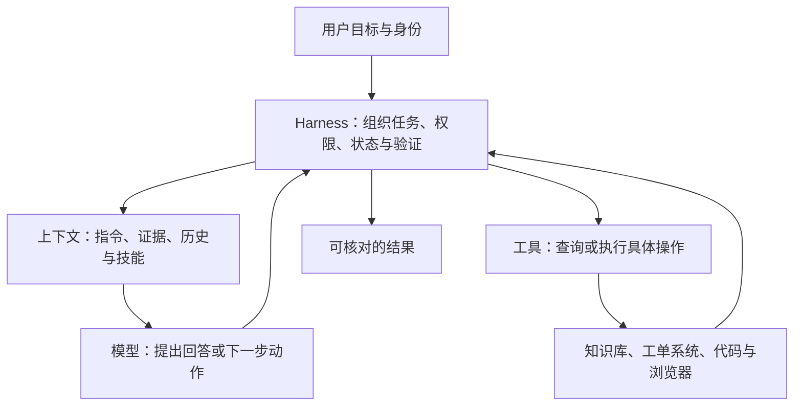

# AI Agent 原理与工程：从理解本质到面试和工作

> 读者起点：有基本 Python、HTTP/API 开发经验，没有系统学过 Agent。资料核对日期：**2026-09-15**。

这套资料围绕三个目标编写：知道一种技术为什么出现，能在面试里解释机制与边界，能在工作中根据证据定位问题。每篇从具体问题出发，配合例子、流程或比较表，并给出可回查的依据。

**内容来源说明：** 你提供的是 9 个 Markdown 文件名的截图，没有提供文件正文。这里按这些主题重新编写教程，不能视为原文件的摘要或还原。工单、事故、练习题与费用算例都是教学设计；原始论文、官方规范和产品文档分别在各章标注。

## 1. 先把整套知识放到一张图里

先记住这条主线：**模型提出动作，程序执行动作，外部结果提供反馈，业务规则决定是否真的完成。**

其他词都可以放回这条线上：ReAct 组织反馈循环；RAG 为模型选择证据；Skill 提供可复用的任务方法；MCP 连接宿主与能力提供方；Runtime 运行代码；多模型与多 Agent 改变任务分配方式；评估检查系统是否满足目标。

这些是理解责任的划分，不要求你在代码里逐项建立组件。有些现成产品会把多种责任一起实现。

## 2. 阅读目录

| 文档 | 核心问题 | 读完应能做什么 |
|---|---|---|
| [01｜ReAct、计划执行与多 Agent](01-react-plan-execute-multi-agent.md) | 下一步由谁决定，怎样拆任务？ | 区分固定流程、动态反馈与任务分工 |
| [02｜记忆、RAG 与长上下文](02-memory-rag-long-context.md) | 信息保存在哪里，本次该取什么？ | 区分资料、检索、上下文和生成问题 |
| [03｜工具调用、HITL 与安全](03-tool-call-hitl-security.md) | 模型建议怎样变成可控的真实动作？ | 解释授权、注入防护、审批与幂等 |
| [04｜MCP、Chrome DevTools 与 CDP](04-mcp-chrome-devtools-cdp.md) | 工具和浏览器如何接到 Agent 上？ | 沿协议、服务、浏览器分层排查 |
| [05｜Prompt、Skill 与提示词工程](05-prompt-skill-prompt-engineering.md) | 怎样把目标和工作方法表达清楚？ | 写出可验收的任务指令，理解技能边界 |
| [06｜TUI、LSP、快照与 Runtime](06-tui-lsp-snapshot-runtime.md) | 界面、代码理解、执行与恢复分别负责什么？ | 区分静态诊断、运行结果和各种状态快照 |
| [07｜多模型切换与成本](07-multi-model-switching-cost.md) | 怎样选择模型并算清完成任务的费用？ | 评估路由、缓存、回退和成功任务成本 |
| [08｜Claude Code、Codex 与 LangChain](08-claudecode-codex-langchain.md) | 在选择开发工具，还是应用框架？ | 区分产品与实现层，进行有依据的选型 |
| [09｜Harness](09-harness.md) | 谁保证任务能持续执行、恢复和验收？ | 从整体解释 Agent 系统，并运行最小循环 |
| [10｜30 道面试题与解析](10-interview-questions-and-answers.md) | 如何讲清机制并接住追问？ | 练习定义、原理、边界和场景设计 |
| [11｜10 个工作排查案例](11-workplace-troubleshooting.md) | 出错后先看哪里，怎样证明修好了？ | 按证据定位、修复并留下回归案例 |
| [12｜AI / Agent 工程学习路线](12-ai-agent-learning-roadmap.md) | 编程、前后端、AI 与工程能力应该怎样学？ | 按掌握等级、阶段验收与官方资源推进学习 |

## 3. 建议怎么学

如果想先确定完整的学习方向，先读[第 12 篇学习路线](12-ai-agent-learning-roadmap.md)：它覆盖编程语言、前后端、模型基础、Agent、评估与部署，并说明哪些必修、哪些按需深入。

**第一轮，建立主线：01 → 02 → 03 → 09。** 先回答“模型如何获得信息、决定动作、执行并停止”。如果觉得概念太多，只围绕这四篇中的工单例子复述一遍。

**第二轮，理解工具与环境：04 → 05 → 06 → 08。** 把协议、技能、编辑器能力、执行环境和产品放回正确层次。不要把“安装了 MCP”误解为“已经拥有所有工具”，或把“有 Skill”误解为“已经获得权限”。

**第三轮，做工程判断：07 → 11。** 练习在正确率、成本、延迟与复杂度之间作选择。排查时先确认原因，再换模型或加框架。

**第四轮，练表达：10。** 先独立回答，再看解析。能讲术语后，继续问自己：“这在哪种情况下会失效？我用什么证据证明方案有效？”

主题篇配有练习与答案；第 12 篇另外给出分阶段项目与验收标准。第 06、09 章各有一个完整的 Python 小实验，不需要模型 API、付费账号或新依赖；其余流程、JSON、费用数字是明确标识的教学示意，不是一套已经上线的应用。

## 4. 贯穿全书的工单助手

假设客服提出：“帮我查清退款问题，准备回复，经过确认再更新工单。”

| 阶段 | 系统做什么 | 关键边界 |
|---|---|---|
| 确定身份 | FastAPI 服务取得登录用户与租户 | 身份不能由模型自报 |
| 获取信息 | 查授权工单和有效知识库 | 用户陈述、政策规则与实时状态不能混为事实 |
| 准备方案 | 生成带来源的回复草稿 | 草稿不是已发送的回复 |
| 确认动作 | 核对目标、正文、版本与审批人 | 批准应与具体动作匹配 |
| 执行提交 | 服务端授权、幂等与并发检查 | 超时不代表没执行，重试不能造成重复提交 |
| 验证结果 | 查询或核对持久化后的业务状态 | 模型说完成不能替代结果证据 |

这是教学需求，不代表本仓库已实现这些接口。贯穿案例帮助你看到：RAG 答错、工具越权、任务恢复和成本上升，经常发生在同一条业务链的不同位置。

## 5. 术语速查

| 术语 | 先记住的含义 | 容易混淆的点 |
|---|---|---|
| LLM | 根据上下文生成输出的语言模型 | 不是整个 Agent 系统 |
| Token | 模型处理文本等输入输出时使用的计量单位 | 不固定等于一个汉字或一个单词 |
| Context | 本次推理可用的信息 | 容量大不等于内容被正确使用 |
| Agent | 在约束内依据观察动态选择动作的执行过程 | 业内定义有差异，不靠调用次数判定 |
| ReAct | 推理与行动交替的模式 | 不是前端 React |
| RAG | 检索外部证据并辅助生成 | 不等于向量数据库，也不保证事实正确 |
| Embedding | 把内容表示为向量，便于相似度等计算 | 相似不等于真实或有权访问 |
| Chunk | 为检索和处理切出的内容片段 | 固定长度不是通用最优方案 |
| Top-K | 取排序靠前的 K 个候选 | 越多不一定越好 |
| Rerank | 对已有候选再排序 | 无法补回根本没找到的资料 |
| Tool call | 模型提出或运行系统处理的工具调用 | 结构正确不等于业务正确 |
| HITL | 人在关键步骤参与判断或批准 | 审批不能替代权限校验 |
| MCP | 连接 AI 宿主与外部能力的协议 | 协议不等于具体工具或驱动 |
| CDP | 程序检查和控制 Chromium 的调试协议 | 和 MCP 处于不同接口层 |
| Skill | 可复用的任务指令、资源和可选脚本 | 文本不能自行授予执行权限 |
| TUI / LSP | 终端交互界面 / 语言服务器协议 | 一个偏交互，一个偏代码分析 |
| Runtime | 实际运行代码、命令和任务的环境 | 本地执行不代表模型推理也在本地 |
| Checkpoint | 一定范围内可恢复的运行状态 | 不会自动撤销外部副作用 |
| Harness | 模型外围的任务组织、执行与控制系统 | 也可能指评测框架，须看上下文 |
| Trace / Evals | 一次执行的轨迹 / 系统化评估 | 一个帮助定位过程，一个比较效果 |
| 幂等 | 重复同一逻辑操作不额外产生预期外的业务效果 | 不能只靠模型承诺“不重复” |

## 6. 怎样理解这里的“最新”和“有依据”

本次实际读取了原始论文页面、官方规范、官方工程文章和产品文档；**查阅日期不等于这些内容都发布于该日，也不表示覆盖了当天所有发布。** 资料分成三类：

- **稳定原理：** 例如工具反馈循环、参数化知识与外部信息、状态和副作用的区别。使用原始来源解释机制。
- **当前功能：** 例如 MCP/LSP 版本、Skill 格式、框架入口、缓存计费。标注查阅日与适用条件，实施前需匹配实际安装版本。
- **工程建议：** 例如工单审批流程、选型起点、排查顺序。解释理由与代价，不把建议冒充协议硬性要求或实验定律。

本次核对后特意保留了几处容易沿用旧知识的更新：

| 更新点 | 教程如何处理 |
|---|---|
| MCP 官方资料当前包含 2026-07-28 版本的无状态请求与发现机制 | 第 04 章注明版本；协议无状态不代表工具和业务没有状态 |
| LSP 3.18 当前标为 Current，3.19 标为 Upcoming | 第 06 章区分规范状态与客户端实际支持 |
| Agent Skills 已有开放格式规范 | 第 05 章解释渐进加载，以及可选、实验字段的宿主差异 |
| LangChain 当前以 `create_agent` 等能力提供可配置 Harness | 第 08 章不沿用“只是把 Chain 串起来”的旧概括 |
| 模型缓存可能区分读取和单独计费的写入 | 第 07 章给出分项核算，真实价格不写成永久结论 |
| 评估方法与具体评估产品有不同寿命 | 第 09 章提醒查阅服务状态，学习方法不依赖某个托管平台 |

论文部分明确区分原始方法与今天的广义工程用法，引用摘要时不扩展未读的实验细节。对于某个模型“最好”、某个架构“一定提升”之类的判断，本教程要求任务数据与可复现评估，不能仅凭宣传、排行榜或一次演示得出结论。

各章的来源列表给出实际参考页面。需要核对一句话时，先看它对应的原始来源和适用范围；遇到后续页面更新或产品变更，以实际部署版本的文档为准。

## 7. 学会的检验标准

读完后，尝试不看资料完成下面五件事：

1. 画出工单助手从用户请求到业务验收的完整过程，并标出权限边界。
2. 解释 RAG、长上下文与记忆分别解决什么问题，并给出不需要向量库的例子。
3. 解释一次工具超时为什么可能已经成功，以及怎样避免重复写入。
4. 用同一批任务比较两个模型或两种架构，说明指标与比较条件。
5. 对一个错答案提出两个不同原因，设计能把它们区分开的检查。

如果其中某项讲不清，就回到对应章节和工作案例。学习的进展体现在你能作出更准确的判断，并用证据解释自己的选择。
